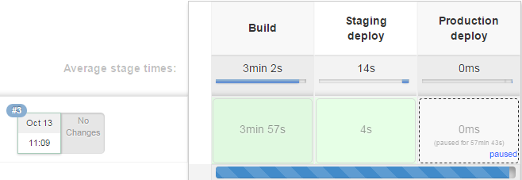
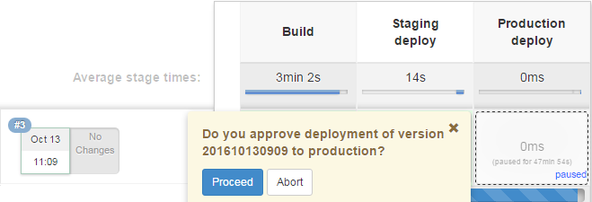

# Felles statistikkhåndtering i det offentlige (PoC)

Dette prosjektet inneholder en proof-of-concept for håndtering av statistikkdata fra felleskomponenter.

## Bygging og utrulling

Prosjektet leverer Java-tjenester pakket inn i Docker-bilder.

### Forutsetninger

Du må ha følgende installert:

* JDK 1.8 eller nyere.
* Maven 3.3 eller nyere.
* [Docker](https://www.docker.com/products/docker-toolbox) 1.12 eller nyere.

Du trenger også nettverkstilgang til Difi sin [artifakt-brønn](http://eid-artifactory.dmz.local:8080).

### Lag Docker-bilder

Dette bygger Docker-bilder for prosjektets artifakter.

```
$ mvn package
```

### Verifiser at Docker-bildene fungerer som de skal

Følgende kjører et sett med integrasjonstester for å verifisere at Docker-bildene fungerer korrekt.

```
$ mvn verify
```

### Start applikasjonen i ditt lokale Docker-miljø

Slik startes en enkeltinstans av applikasjonen på din lokale Docker-maskin:

```
$ docker run -d --name elasticsearch --restart=unless-stopped difi/statistics-elasticsearch:DEV-SNAPSHOT
$ docker run -d --name statistics-query --restart=unless-stopped --link elasticsearch -p 8080:8080 difi/statistics-query-elasticsearch:DEV-SNAPSHOT
$ docker run -d --name statistics-ingest --restart=unless-stopped --link elasticsearch -p 8081:8080 difi/statistics-ingest-elasticsearch:DEV-SNAPSHOT
```

Endepunktet til applikasjonen vil da være tilgjengelig på http://$(docker-machine ip).

_Dette forutsetter at port 80 er tilgjengelig i Docker-maskinen din. Hvis ikke kan du endre port-assosiasjonen i
p-flagget ovenfor._

Alternativt kan applikasjonen startes via Maven:

```
$ mvn -pl statistics-query-elasticsearch,statistics-ingest-elasticsearch,statistics-elasticsearch docker:run
```

Merk at i dette tilfellet benyttes dynamisk port-assosiasjon, så du må inspisere konteinerne for å utlede endepunktet.

Konteinerne stoppes og fjernes tilsvarende på denne måten:
```
$ mvn -pl statistics-query-elasticsearch,statistics-ingest-elasticsearch,statistics-elasticsearch docker:stop
```

### Start applikasjonen på en Docker-sverm

_Denne beskrivelsen forutsetter at det allerede er satt opp en [Docker-sverm](https://docs.docker.com/engine/swarm) og
at Docker-klienten peker til en manager-node._

Lag først et overlay-nettverk tjenestene kan kommunisere på. Pass på at sub-nettet ikke kolliderer med andre eksisterende
sub-nett:
```
$ docker network create -d overlay --subnet 10.0.1.0/24 statistics
```

Elasticsearch-klyngen kan startes slik, her med én data-node per sverm-node (_global modus_) og én _gossip_-node per sverm-_manager_:
```
$ docker service create --network statistics --constraint 'node.role == manager' --name elasticsearch_gossip -p 9201:9201 -p 9301:9301 difi/statistics-elasticsearch -Des.http.port=9201 -Des.transport.tcp.port=9301 -Des.node.data=false \
  && docker service create --network statistics --mode global --name elasticsearch -p 9200:9200 -p 9300:9300 difi/statistics-elasticsearch -Des.discovery.zen.ping.unicast.hosts=elasticsearch_gossip:9301 -Des.node.master=false
```

Query-tjenesten kan startes slik:
```
$ docker service create --network statistics --mode global --name statistics-query -p 8080:8080 difi/statistics-query-elasticsearch
```

Og tilsvarende for ingest-tjenesten:
```
$ docker service create --network statistics --mode global --name statistics-ingest -p 8081:8080 difi/statistics-ingest-elasticsearch
```

### Lag en versjonert utgave av applikasjonen

Dette laster opp Docker-bildene til Difi sitt område `difi` på DockerHub. De blir samtidig tagget med et tidsstempel som
gjenspeiler byggetidspunktet.

```
$ mvn deploy
```

### Utrulling av ny versjon

Gitt at applikasjonen kjører som et sett tjenester på Docker i sverm-modus, så kan funksjonaliteten for
[rullerende oppdatering](https://docs.docker.com/engine/swarm/swarm-tutorial/rolling-update) av tjenester benyttes:

```
$ docker service update --image difi/statistics-query-elasticsearch:$VERSION statistics-query
$ docker service update --image difi/statistics-ingest-elasticsearch:$VERSION statistics-ingest
$ docker service update --image difi/statistics-elasticsearch:$VERSION elasticsearch
$ docker service update --image difi/statistics-elasticsearch:$VERSION elasticsearch_gossip
```

>Merk at Docker-klienten her må peke til en av _manager_-nodene i svermen.

## Sporbarhet

Versjonsnummeret kan hentes ved å gjøre en HTTP GET på '/'.

Fra en kjørende konteiner er det mulig å finne ut hvilket Docker-bilde i registeret applikasjonen benytter, samt
hvilken revisjon av kildekoden som er i bruk. Dette er essensielt for feilsøking og feilretting.
 
Docker-bildet finnes slik (gitt at konteineren heter ``statistics-query-elasticsearch``:
```
$ docker ps --filter="name=statistics-query-elasticsearch" --format="{{.Image}}"
```

Kildekode-revisjonen finner du slik (også gitt at konteineren heter ``statistics-query-elasticsearch``):
```
$ docker inspect --format={{.ContainerConfig.Labels.label}} $(docker ps --filter="name=statistics-query-elasticsearch" --format="{{.Image}}")
```

Alternativt kan du finne kildekode-revisjonen gitt navnet på bildet:
```
$ docker inspect --format={{.ContainerConfig.Labels.label}} difi/statistics-query-elasticsearch:20160704142905
```

## Kontinuerlig utrulling

For å understøtte kontinuerlig utrulling benyttes Jenkins sin ['pipeline-as-code'](https://jenkins.io/solutions/pipeline/)-
funksjonalitet. Det benyttes da en _Jenkinsfile_ som ligger på roten av prosjektet og spesifiserer byggejobben. I dette
prosjektet vil endringer på _feature_-grener og _bugfix_-grener føre til at det gjøres et raskt verifiseringsbygg med
automatiske tester (`Build`). Endringer på _develop_-grenen vil utløse et verifiseringsbygg med påfølgende utrulling til
testmiljøet (`Staging deploy`). Status på dette kan følges [her](http://eid-jenkins02.dmz.local/job/poc-statistics/job/develop)
(krever tilgang til Difis lokalnett):



Når applikasjonen er verifisert i testmiljøet kan en knapp trykkes for å fortsette utrulling til produksjonsmiljøet (du
får opp dialogboksen ved å holde musepekeren over boksen under `Production deploy`):




## Oppsett av Docker-sverm på Amazon Web Services (AWS)

1. Lag en IAM-bruker med en separat API-nøkkel og sikkerhets-policien `AmazonEC2FullAccess`.
2. Lag et VPC med et offentlig subnett, som beskrevet [her](http://docs.aws.amazon.com/AmazonVPC/latest/UserGuide/VPC_Scenario1.html).
3. Sett følgende miljøvariabler i arbeidskonsollet ditt:

   | Miljøvariabel         | Verdi
   | --------------------- | ---
   | AWS_ACCESS_KEY_ID     | Id for IAM-brukerens sikkerhetsnøkkel.
   | AWS_SECRET_ACCESS_KEY | Sikkerhetsnøkkelen.
   | AWS_DEFAULT_REGION    | Id for regionen der du opprettet VPCet (f.eks. `us-east-1`).
   | AWS_ZONE              | Sonen der du opprettet subnettet (f.eks. `b`).
   | AWS_VPC_ID            | Id for VPCet (f.eks `vpc-383d445f`).
   | AWS_SUBNET_ID         | Id for subnettet (f.eks `subnet-23548409`).
   | AWS_INSTANCE_TYPE     | Id for EC2-instanstype (f.eks. `c4.large`).
   
4. Lag Docker-maskiner:
   ```
   $ docker-machine create -d amazonec2 aws-manager1 \
     && docker-machine create -d amazonec2 aws-worker1 \
     && docker-machine create -d amazonec2 aws-worker2 \
     && docker-machine create -d amazonec2 aws-worker3
   ```
   Hver `create`-operasjon kan ta noen minutter. For undertegnede tar det ca 6 minutter.
5. Konfigurer `svermen`:
   ```
   $ SWMADR=$(docker-machine inspect --format='{{.Driver.PrivateIPAddress}}' aws-manager1) \
        && docker $(docker-machine config aws-manager1) swarm init --advertise-addr $SWMADR \
        && SWMTKN=$(docker $(docker-machine config aws-manager1) swarm join-token -q worker) \
        && docker $(docker-machine config aws-worker1) swarm join --token $SWMTKN $SWMADR \
        && docker $(docker-machine config aws-worker2) swarm join --token $SWMTKN $SWMADR \
        && docker $(docker-machine config aws-worker3) swarm join --token $SWMTKN $SWMADR
   ```

## Skalerbar ytelse

Ytelsen på spørringene kan skaleres med antall noder, og dette er påvist på følgende måte.

### Oppsett

En Docker-sverm ble satt opp på AWS som beskrevet over, med fire noder og `c4.large`-instanser. Deretter ble applikasjonen
startet på svermen (også beskrevet over).

De tre `aws-worker`-nodene ble deretter fjernet fra svermen:
```
$ docker $(docker-machine config aws-worker1) swarm leave \
  && docker $(docker-machine config aws-worker2) swarm leave \
  && docker $(docker-machine config aws-worker3) swarm leave
```

Testdata ble så lagt inn (dette tar noen minutter, ca 8 da dette ble skrevet):
```
$ docker-machine ssh aws-manager1 "curl -XPOST -H 'Content-Type: application/json;charset=UTF-8' http://localhost:8081/minutes/perf?from=2016-01-01T00:00:00.000Z\&to=2016-04-01T00:00:00.000Z"
```

JMeter ble benyttet for selve testingen. En trådgruppe med en `HTTP forespørsel` og følgende verdier ble brukt:

Attributt              |Verdi 
-----------------------|:---
IP                     | Som gitt av `docker-machine ip aws-manager1`
Port                   | 8080
Tidsavbrudd oppkobling | 10000
Tidsavbrudd respons    | 10000
Sti                    | `months/perf?from=2016-01-01T00:00:00.000Z&to=2016-04-01T00:00:00.000Z`

### Forsøk 1 - én node

Én node ble benyttet, som i initielt oppsett. Vilkårlige tester viste at maks tre tråder kunne benyttes
for å få en feilrate på mindre enn 0.1%, så tre tråder ble benyttet i dette forsøket. Varighet av testen ble satt til fem minutter (300 sekunder).

### Forsøk 2 - to noder

En ekstra node ble lagt til initielt oppsett. Legg merke til at Docker-tjenesten på noden restartes
først. Dersom dette ikke gjøres feiler oppstart av Elasticsearch med `UnknownHostException`. Dette
er muligens en _bug_ i Docker, og den kan for dette formålet omgås med denne omstarten.

```
$ docker-machine ssh aws-worker1 sudo systemctl restart docker.service
$ docker $(docker-machine config aws-worker1) swarm join --token $SWMTKN $SWMADR
```

Elasticsearch vil umiddelbart starte en relokasjon av indeksene sine for å utnytte den nye noden. Dette
forsøket ble utført når denne relokasjonen var sluttført. Dette kan undersøkes med følgende kommando:

```
$ docker-machine ssh aws-manager1 curl -s localhost:9200/_cat/allocation\?v
```

Her skal hver av de to nodene ha like mange `shards`.

Etter vilkårlige tester ble det funnet at forsøket kunne kjøres med åtte tråder uten at feilraten oversteg 0.1%.

### Forsøk 3 - tre noder

Tredje node ble lagt til oppsettet:

```
$ docker-machine ssh aws-worker2 sudo systemctl restart docker.service
$ docker $(docker-machine config aws-worker2) swarm join --token $SWMTKN $SWMADR
```

Forsøket ble startet etter sluttført relokasjon.

### Forsøk 4 - fire noder

Fjerde node ble lagt til oppsettet:

```
$ docker-machine ssh aws-worker3 sudo systemctl restart docker.service
$ docker $(docker-machine config aws-worker3) swarm join --token $SWMTKN $SWMADR
```

Forsøket ble startet etter sluttført relokasjon.

### Resultater

Attributt                     |Forsøk 1 |Forsøk 2 | Forsøk 3 | Forsøk 4
------------------------------|--------:|--------:|---------:|--------:
Antall noder                  | 1       | 2       | 3        | 4
Antall tråder                 | 3       | 8       | 13       | 19
Feilandel %                   | 0.00    | 0.05    | 0.02     | 0.08
Antall forespørsler           | 2568    | 4159    | 5364     | 6400
Gjennomsnittstid              | 350     | 576     | 726      | 890
Mediantid                     | 348     | 585     | 723      | 879
90. persentil tid             | 435     | 722     | 915      | 1134
95. persentil tid             | 450     | 764     | 976      | 1208
99. persentil tid             | 480     | 878     | 1112     | 1373
Gjennomstrømming forespørsler | 8.6/s   | 13.8/s  | 17.9/s   | 21.3/s
Gjennomstrømming data         | 3.7 KB/s| 6 KB/s  | 7.7 KB/s | 9.2 KB/s

### Konklusjon

Tjenesten skalerer horisontalt og i hvertfall opp til fire noder. Responstiden øker
samtidig noe.

## Javaklient

Det er laget en javaklient som skal kunne benyttes av applikasjoner for å legge inn data i statistikkløsningen. For å bruke denne forutsettes det at dette er installert:

* JDK 1.8 eller nyere.

Klienten kan lastes ned herfra: http://eid-artifactory.dmz.local:8080/artifactory/libs-snapshot-local/no/difi/statistics/statistics-client-ingest/DEV-SNAPSHOT/statistics-client-ingest-DEV-*dato*.*versjonsnummer*.jar

Det kan skrives kode mot denne direkte, eller den kan testes ved hjelp av et REST-grensesnitt i front, som kan lastes ned herfra:

http://eid-artifactory.dmz.local:8080/artifactory/libs-snapshot-local/no/difi/statistics/statistics-demo-for-client-ingest/DEV-SNAPSHOT/statistics-demo-for-client-ingest-DEV-*dato*.*versjonsnummer*.jar

Dette kan kjøres opp ved hjelp av 
```
$ java -jar statistics-demo-for-client-ingest-DEV-*dato*.*versjonsnummer*.jar [-DserviceURL=URL-til-tjenesten (statistics-ingest)]
```
Hvis ikke URL defineres går den mot URL'en http://eid-test-docker01.dmz.local:10009, hvor tjenesten skal være deployet i test.
